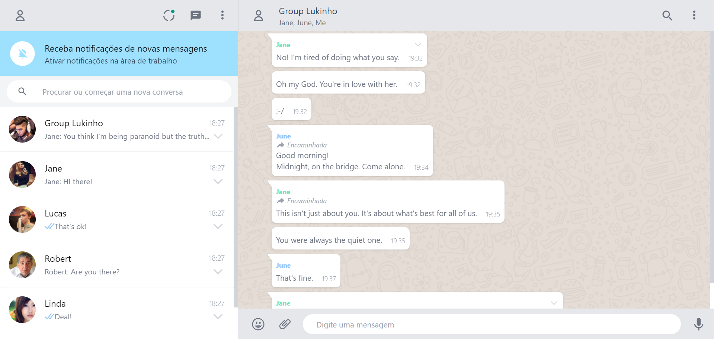

# WhatsApp Clone

## Introduction

This is a [Next.js](https://nextjs.org/) project bootstrapped with `yarn create next-app` and styled using [Tailwind CSS](https://tailwindcss.com/).

The goal is not to create a complete application, just a boilerplace of a chat application using the visual style of WhatsApp Web.

## Demo



## Getting Started

First, clone this repository:
```bash
git clone https://github.com/bgarrofe/whatsapp-clone.git
```

Then, run:
```bash
npm install 
# or
yarn
```

And finally, run the development server:

```bash
npm run dev
# or
yarn dev
```

Open [http://localhost:3000](http://localhost:3000) with your browser to see the result.

You can start editing the page by modifying `pages/index.js`. The page auto-updates as you edit the file.

## Dependencies

- [Next.js](https://nextjs.org)
- [React](https://reactjs.org/)
- [Tailwind CSS](https://tailwindcss.com/)

## To Do List

This is an ongoing project. There are many missing things. Feel free to contribute if you like.

- [ ] Create profile drawer
- [ ] Create status modal
- [ ] Create new chat drawer
- [ ] Create search functionality
- [ ] Create emoji options
- [ ] Create contact/group drawer
- [ ] Create message list context menu
- [ ] Create message contect menu
- [ ] Render different kind of medias (documents, images, etc)
